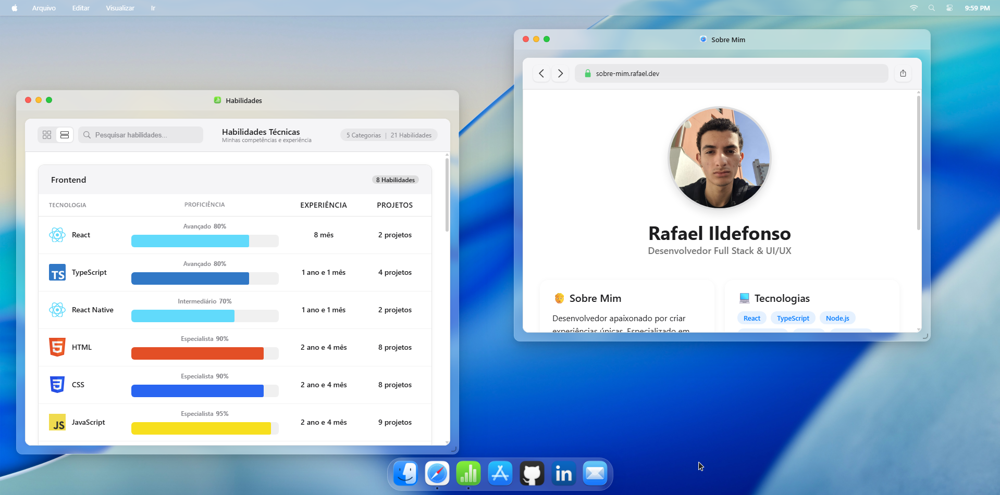

# Projeto 🖥️ Portfólio Interativo - macOS Style

<div align="center">
  
  
  [](https://github.com/rafaelildefonso/portfolio/releases)
  [](https://reactjs.org/)
  [](https://www.typescriptlang.org/)
  [](https://vitejs.dev/)
  [](LICENSE)
</div>

## 🌟 Visão Geral

Bem-vindo ao meu portfólio interativo inspirado no macOS! Este projeto é uma experiência única que combina design moderno com interatividade, criando uma experiência de usuário imersiva que se assemelha ao sistema operacional da Apple.

## ✨ Funcionalidades Principais

- **Interface macOS Autêntica**
  - Dock interativo com ícones animados
  - Sistema de janelas arrastáveis e redimensionáveis
  - Menu superior com opções de navegação
  - Efeitos sonoros autênticos

- **Modo Claro/Escuro**
  - Alternância suave entre temas
  - Preferência salva no navegador
  - Design consistente em todas as páginas

- **Aplicativos Personalizados**
  - **Safari**: Navegação pelo portfólio
  - **Mail**: Formulário de contato funcional
  - **Numbers**: Apresentação de habilidades e estatísticas
  - E mais...

- **Interatividade**
  - Animações suaves
  - Efeitos de genie nas janelas
  - Menu de contexto com atalhos
  - Controle de volume e brilho

## 🚀 Tecnologias Utilizadas

- **Frontend**
  - React 18 + TypeScript
  - Vite para build e desenvolvimento
  - CSS Modules para estilização
  - Framer Motion para animações
  - React Icons para ícones

- **Funcionalidades Avançadas**
  - Gerenciamento de estado com Context API
  - Efeitos sonoros interativos
  - Responsividade para diferentes tamanhos de tela
  - Otimização de performance

## 🛠️ Como Executar Localmente

Acesse a demo:
   ```
   https://portfolio-rafaelildefonso.vercel.app/
   ```

## 📂 Estrutura do Projeto

```
src/
├── apps/               # Aplicativos do sistema
│   ├── Mail/          # Aplicativo de e-mail/contato
│   ├── Safari/        # Navegador do portfólio
│   └── Numbers/       # Estatísticas e habilidades
├── assets/            # Recursos estáticos
├── components/        # Componentes reutilizáveis
│   ├── Dock/          # Barra de aplicativos
│   ├── Window/        # Componente de janela
│   ├── MenuBar/       # Barra de menu superior
│   └── ...
├── contexts/          # Contextos React
├── hooks/             # Hooks personalizados
└── utils/             # Utilitários e helpers
```

## 🎨 Design System

- **Cores Principais**
  - Azul: `#007AFF`
  - Cinza Claro: `#F5F5F7`
  - Cinza Escuro: `#1D1D1F`
  - Branco: `#FFFFFF`
  - Preto: `#000000`

- **Tipografia**
  - Família: SF Pro Display, -apple-system, sans-serif
  - Tamanhos: 12px a 48px
  - Pesos: 300 a 700

## 📱 Responsividade

O portfólio foi projetado para funcionar perfeitamente em:
- Desktop (acima de 1024px)
- Tablets (768px - 1024px)
- Celulares (até 767px)

## 📝 Requisitos do Projeto

- [x] Interface responsiva
- [x] Modo claro/escuro
- [x] Formulário de contato funcional
- [x] Seção de habilidades
- [x] Portfólio de projetos
- [x] Links para redes sociais
- [x] Animações e interações
- [x] Validação de formulário
- [x] Efeitos sonoros
- [x] Menu de contexto

## 🤝 Contribuição

Contribuições são bem-vindas! Sinta-se à vontade para abrir issues e enviar pull requests.

## 📄 Licença

Este projeto está licenciado sob a licença MIT - veja o arquivo [LICENSE](LICENSE) para mais detalhes.

---

<div align="center">
  Feito por [Rafael Ildefonso] - [2025] 
</div>
